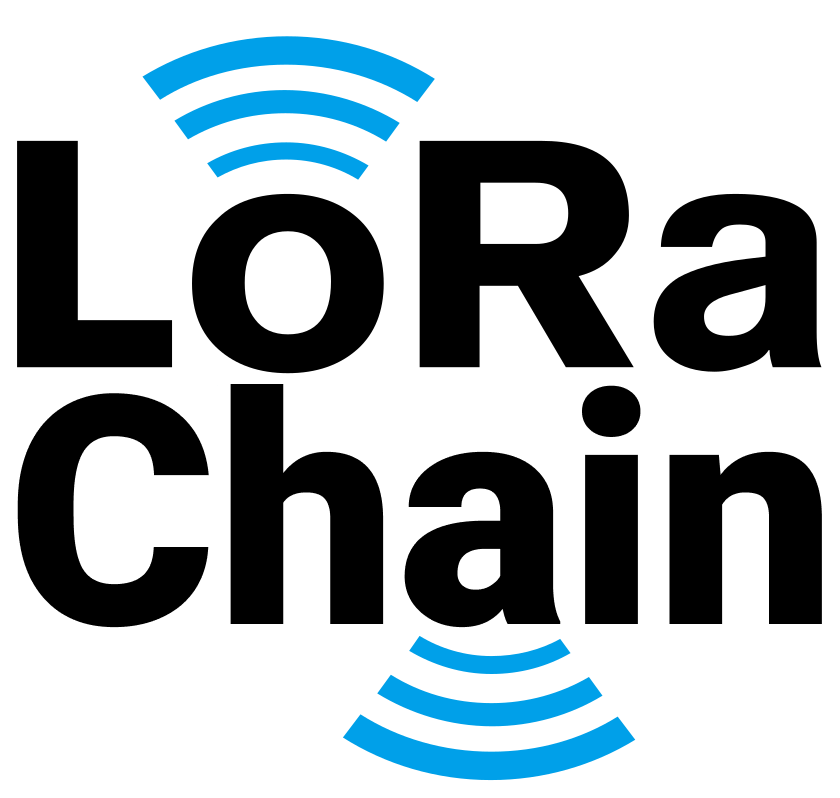

# Neden ?

Günümüzde toplumlar; devletler ve onların müttefiki şirketler tarafından küresel boyutta bir gözetlenebilen, dinlenebilen, izlenebilen, mahremiyetine önem verilmeyen konumda bulunuyorlar. Bunun önüne geçmek için ya [WikiLeaks’in kurucusu Julian Assange’ın savunduğu gibi](https://en.wikipedia.org/wiki/Cypherpunks_(book)) güçlü şifreleme teknikleri kullanacağız ya da mevcut internet altyapısını kullanmadan iletişim kuracağımız sistemler kullanacağız.

LoRaChain burada amaç kazanıyor. LoRa kullanıcılarından oluşan bir ağ üzerinden ücretsiz, şifreli, hiçbir şirket ve/veya devletin kontrolü altında olmayan, sunucusuz yapısıyla muhtaç kaldığımız mahremiyeti sunuyor.

